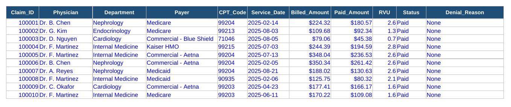
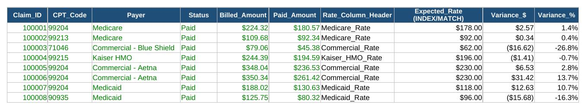
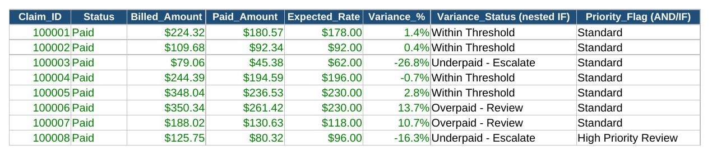
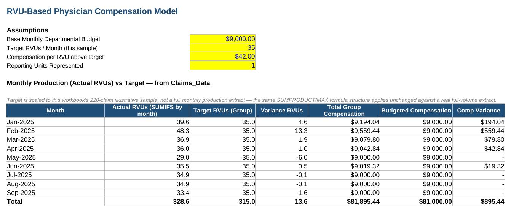
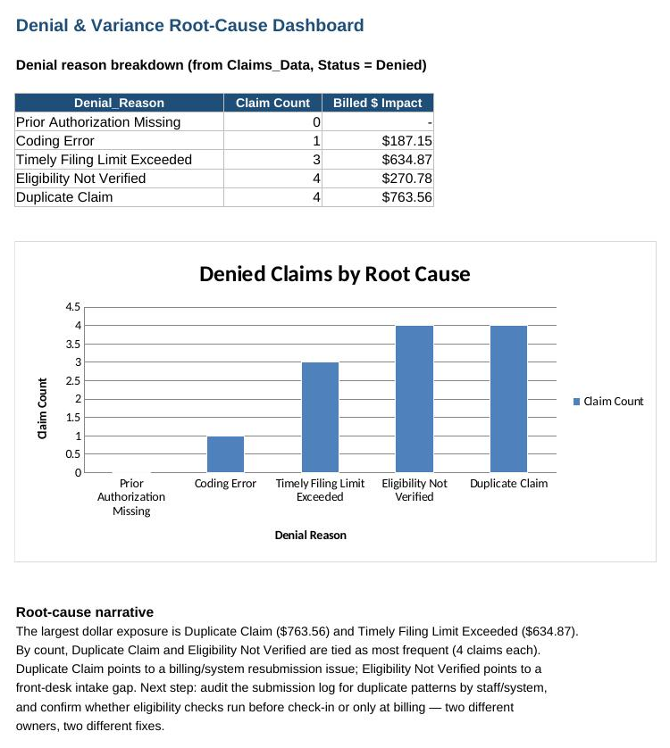

# Physician Financial Services Analytics Portfolio

**Korede Katibi, MBA** — built for interview prep: **Kaiser Permanente, Physician Financial Services Consultant III (Req #1436508)**

This portfolio simulates a physician-group revenue cycle and reimbursement analytics workflow — claims data, contracted payer rates, variance detection, and financial modeling — using the exact Excel toolset requested for the role.

## Skills demonstrated

- Pivot Tables · VLOOKUP/XLOOKUP · INDEX/MATCH · Complex nested IF statements
- Power Query (data consolidation) · Data Validation · Financial modeling
- Macros/VBA · Formula auditing · Root cause analysis

| Tool | Where it lives |
|---|---|
| Pivot Tables | `Claims_Data` is a native Excel Table (`tbl_Claims`); `Pivot_Summary` tab |
| VLOOKUP / XLOOKUP | `VLOOKUP_Analysis` tab (with a documented note on where VLOOKUP breaks) |
| INDEX/MATCH | `INDEX_MATCH_Analysis` tab (two-way lookup: CPT code + payer) |
| Complex IF Statements | `Complex_IF_Variance_Flags` tab (nested IF + AND logic) |
| Power Query | `EHR_Export` / `Billing_Export` / `Power_Query_Consolidated` tabs + `consolidate_claims.pq` |
| Data Validation | Dropdowns on `Claims_Data` (Department, Payer, Status, Denial Reason) |
| Financial Models | `Financial_Model` tab — RVU-based physician compensation model |
| Macros/VBA | `RefreshAndFormatDashboard.bas`, `HighlightVarianceOutliers.bas`, `ExportRootCauseSummaryToPDF.bas` |
| Formula Auditing | `Formula_Auditing_Notes` tab |
| Root Cause Analysis | `Root_Cause_Dashboard` tab — denial breakdown, chart, and written root-cause narrative |

## Screenshots

**Claims_Data** — source table with Data Validation dropdowns

**INDEX_MATCH_Analysis** — two-way lookup resolving the correct contracted rate by CPT code *and* payer

**Complex_IF_Variance_Flags** — nested IF decision tree plus an AND-based priority flag

**Financial_Model** — RVU-based physician compensation model, assumptions-driven

**Root_Cause_Dashboard** — denial breakdown, chart, and written root-cause narrative

## Repo contents

| File | What it is |
|---|---|
| `Physician_Financial_Services_Portfolio.xlsx` | **The main workbook — open this first.** 12 tabs covering all 10 tools above. |
| `consolidate_claims.pq` | Power Query M-code for merging the EHR + Billing source exports. Paste into Excel via *Data > Get Data > Launch Power Query Editor > Advanced Editor*. |
| `RefreshAndFormatDashboard.bas` | VBA macro: refreshes all formulas/connections and reapplies formatting to the reporting tabs. |
| `HighlightVarianceOutliers.bas` | VBA macro: color-codes high-priority and underpaid claims for visual triage. |
| `ExportRootCauseSummaryToPDF.bas` | VBA macro: exports the Root_Cause_Dashboard tab to a dated PDF. |
| `root_cause_writeup.md` | Standalone written root-cause narrative — same content as the `Root_Cause_Dashboard` tab. |
| `screenshots/` | PNG screenshots of key tabs, embedded above. |
| `README.md` | This file. |

To import a macro: open the workbook in Excel, press *Alt+F11* to open the VBA editor, then *File > Import File* and select the `.bas` file.

## Scenario

A 220-claim illustrative sample across five departments (Nephrology, Cardiology, Internal Medicine, Endocrinology, Family Medicine), five payer types (Medicare, Medicaid, Kaiser HMO, and two commercial plans), and ten CPT codes — modeled after the kind of physician-services revenue cycle data referenced in my experience at Bethsaida Nephrology and the variance/root-cause work I did at USAA.

## How to use each tab (suggested interview walkthrough order)

1. **Overview** — one-page map of the workbook.
2. **Claims_Data** — the source of truth. It's a real Excel Table, so it's already the source for a native PivotTable (`Insert > PivotTable`) and for the Power Query source tabs.
3. **Reimbursement_Rates** — the contracted rate table, including the `Payer_Rate_Map` helper table used by INDEX/MATCH.
4. **VLOOKUP_Analysis** → **INDEX_MATCH_Analysis** — walk through *why* INDEX/MATCH replaces VLOOKUP here: VLOOKUP's column index is hard-coded and breaks if a column moves; INDEX/MATCH resolves the payer's rate column dynamically by name.
5. **Complex_IF_Variance_Flags** — the nested-IF decision tree that turns raw variance into an actionable status, plus an AND-based priority flag.
6. **Pivot_Summary** — the native-table pivot source, plus a SUMIFS/COUNTIFS cross-tab as a transparent, always-live alternative.
7. **EHR_Export / Billing_Export / Power_Query_Consolidated** — the two "source systems," their merge, and the actual M-code in `consolidate_claims.pq` that would produce it live in Excel.
8. **Financial_Model** — change any yellow assumption cell and watch every month recalculate.
9. **Root_Cause_Dashboard** — the chart plus a written root-cause narrative (see `root_cause_writeup.md`).
10. **Formula_Auditing_Notes** — the auditing discipline used while building the file (Trace Precedents/Dependents, Evaluate Formula, IFERROR guards).
11. **VBA_Macros** — macro descriptions; actual code in the `.bas` files above.

## Honest technical notes

- **Power Query and VBA can't be authored as live, compiled objects outside Excel's own engine.** The M-code and VBA modules here are real, complete, and ready to paste/import — `consolidate_claims.pq` via *Data > Get Data > Launch Power Query Editor > Advanced Editor*, and each `.bas` file via *Alt+F11 > File > Import File*. The workbook itself shows what each would produce, built with live formulas so it's fully verifiable.
- **XLOOKUP**: the newer XLOOKUP/dynamic-array functions aren't included as live formulas because they need a very recent Excel build to evaluate reliably; INDEX/MATCH is used throughout as the more portable, universally-supported equivalent.
- The Financial_Model's RVU target is scaled to this workbook's 220-claim illustrative sample (not a full monthly production extract) — the formula structure is what would carry over unchanged to a real dataset.
- All claims data in this workbook is synthetic (randomly generated for this demo), not real patient, payer, or Kaiser data.
